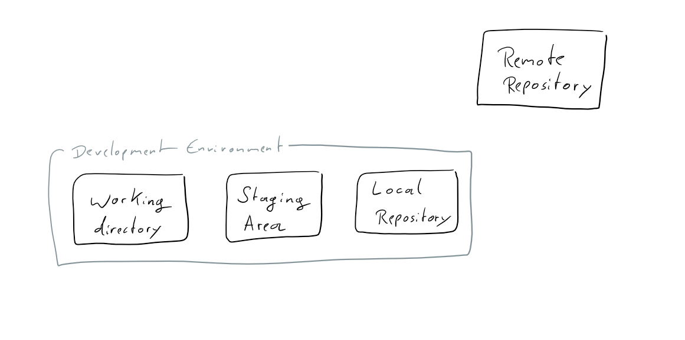

# Aprendiendo lenguaje `markdown`

**Curso de GitHub del CRIF**

Probando texto normal

---

> Recuadro y enlace a mi repositorio [Es este](https://github.com/sbaezfedu/conflicto).

---

- [Enlace a sección 1](#estructura)

## Estructura

Esta es la estructura de GitHub con una imagen en una ruta del repositorio

Y aquí se muestra una imagen de una ruta de internet

